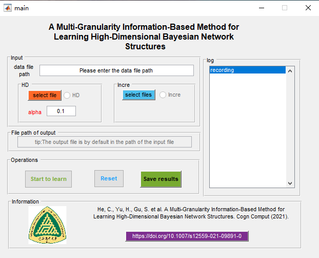
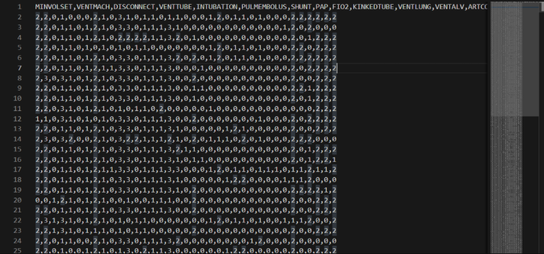
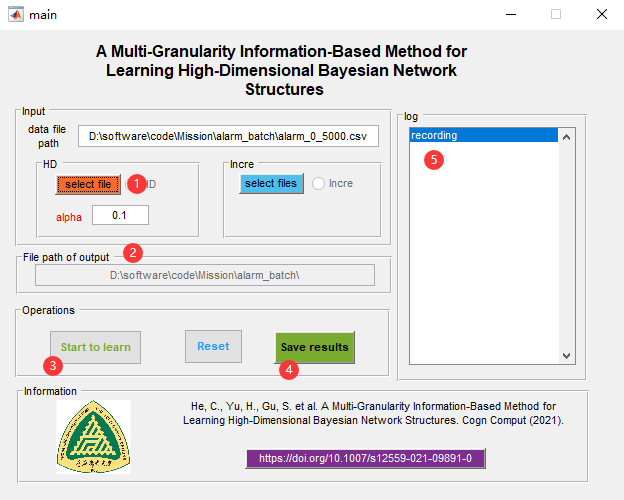

# A Multi-Granularity Information-Based Method for Learning High-Dimensional Bayesian Network Structures


> **Abstract**
>
> The purpose of structure learning is to construct a qualitative relationship of Bayesian networks. Bayesian network with interpretability and logicality is widely applied in a lot of fields. With the extensive development of high-dimensional and low sample size data in some applications, structure learning of Bayesian networks for high dimension and low sample size data becomes a challenging problem. To handle this problem, we propose a method for learning high-dimensional Bayesian network structures based on multi-granularity information. First, an undirected independence graph construction method containing global structure information is designed to optimize the search space of network structure. Then, an improved agglomerative hierarchical clustering method is presented to cluster variables into sub-granules, which reduces the complexity of structure learning by considering the variable community characteristic in high-dimensional data. Finally, the corresponding sub-graphs are formed by learning the internal structure of sub-granules, and the final network structure is constructed based on the proposed construct link graph algorithm. To verify the proposed method, we conduct two types of comparison experiments: comparison experiment and embedded comparison experiment. The results of the experiments show that our approach is superior to the competitors. The results indicate that our method can not only learn structures of Bayesian network from high-dimensional data efficiently but also improve the efficiency and accuracy of network structure generated by other algorithms for high-dimensional data.


- Cite：He, C., Yu, H., Gu, S. *et al.* A Multi-Granularity Information-Based Method for Learning High-Dimensional Bayesian Network Structures. *Cogn Comput* (2021). https://doi.org/10.1007/s12559-021-09891-0

- Article Location：https://link.springer.com/article/10.1007/s12559-021-09891-0


## Contents：

- source code：The folder where the matlab source code  is stored
  - Main.p ：Calling interface for SL_MGI method

- executable files ：executable file
- readme.assets：readme related files
- readme.md ：


Main.p:

```matlab
Main(data, alpha)
```

**input:** 

**data :**  The information for data

**alpha：** The parameter of input


## Introduction to the executable file interface



1. Information input module
   1. Input data file
   2. Choosing a learning style (high-dimensional structured learning)
   3. Input the output file address of the learning result
2. Operation log record, showing each operation process record
3. Operation Module
   1. Learning: Start structure learning
   2. Reset: Reset all information
   3. Save results: BN structure learning results
4. Information module, displaying relevant information

## Input Introduction

High-dimensional structure learning: In the HD panel, select the data file that needs to perform high-dimensional structure learning

Data file type: .csv

### File format

The file format is shown below：



### Parameters

***alpha：***

An important parameter for constructing undirected independence graph, alpha is limited to between [0.01, 0.2].


## Learning Process

- Progress bar showing current learning progress
- Operation log recording




